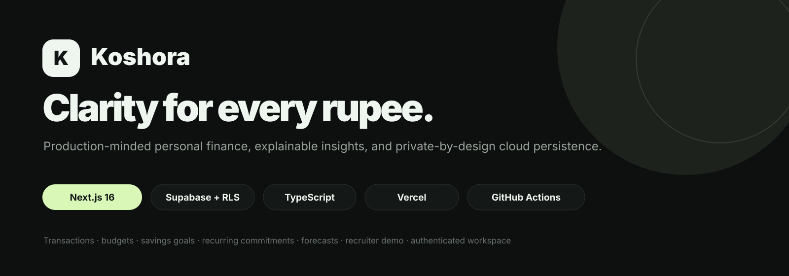
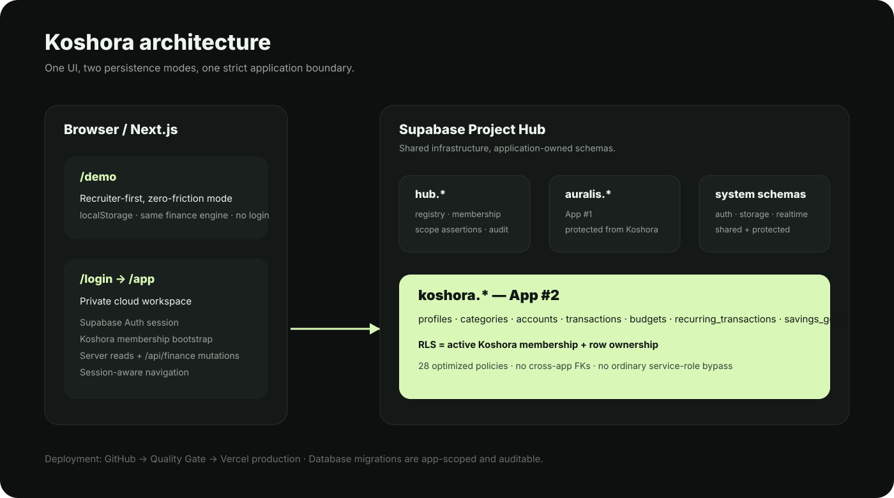

<div align="center">



# Koshora

**A production-minded personal-finance workspace built around clarity, explainable insights, and strict data isolation.**

[](https://github.com/Rishikeshsanin/koshora-finance/actions/workflows/ci.yml)


[**Open production**](https://koshora-finance.vercel.app) · [**Recruiter demo**](https://koshora-finance.vercel.app/demo) · [**Private workspace**](https://koshora-finance.vercel.app/login) · [Architecture](docs/ARCHITECTURE.md) · [Security model](docs/SECURITY_MODEL.md)

</div>

---

## What Koshora does

Koshora turns transactions, budgets, recurring commitments, accounts, and savings goals into one calm financial picture. It is intentionally more than a CRUD expense tracker: the product connects day-to-day activity with deterministic forecasting, budget-risk signals, explainable insights, and a production-grade persistence/security model.

### Product highlights

- **Income, expense, and transfer transactions** with account-aware balance effects
- **Multiple account types** — bank, cash, credit, wallet, and savings
- **Monthly category budgets** with utilization and overspend risk
- **Savings goals** with contribution tracking
- **Recurring commitments** for upcoming cash-flow awareness
- **Six-month cash-flow visualization** and category-spend analysis
- **Explainable month-end forecasting** based on actual behavior rather than opaque “AI” branding
- **CSV export and JSON backup**
- **INR-first formatting** with Indian number grouping
- **Responsive light / dark / system themes**
- **Recruiter demo mode** that needs no account or backend
- **Private cloud mode** backed by Supabase Auth, PostgreSQL, RLS, and app membership
- **Session-aware navigation** so signed-in users are recognized when returning home
- **Signup name capture** stored in Supabase Auth user metadata
- **Auth loading feedback** with disabled submit states, spinner, and progress shimmer

---

## Live product snapshots

> The images below are generated from the live production deployment so the README stays aligned with the shipped UI.

### Landing experience

<a href="https://koshora-finance.vercel.app">
  
</a>

### Authentication workspace

<a href="https://koshora-finance.vercel.app/login">
  
</a>

### Recruiter demo

<a href="https://koshora-finance.vercel.app/demo">
  
</a>

---

## Two modes, one product

| Mode | Route | Persistence | Login | Purpose |
|---|---|---|---|---|
| Recruiter demo | `/demo` | Browser `localStorage` | No | Zero-friction product review |
| Private workspace | `/login` → `/app` | Supabase PostgreSQL | Yes | Real user-owned cloud data |

Both modes use the same finance engine and UI primitives. That keeps the recruiter experience frictionless without reducing the project to a static mockup.

---

## Architecture



```text
Browser / Next.js
  ├─ /demo
  │   └─ FinanceApp + localStorage
  │
  └─ /login → /app
      ├─ Supabase Auth session
      ├─ Koshora membership bootstrap
      ├─ server-side koshora.* read model
      └─ /api/finance authenticated mutations

Supabase Project Hub
  ├─ hub.*       shared control plane — protected
  ├─ auralis.*   App #1 — protected from Koshora
  ├─ koshora.*   App #2 — this application only
  └─ auth/storage/realtime/system schemas — protected shared infrastructure
```

Read the deeper walkthrough in [`docs/ARCHITECTURE.md`](docs/ARCHITECTURE.md).

---

## Security and isolation

Koshora is registered in the shared Supabase **Project Hub** as:

| Property | Value |
|---|---|
| App number | `2` |
| App slug | `koshora` |
| Application schema | `koshora` |
| Status | `active` |
| User-facing tables | `7` |
| RLS-enabled tables | `7 / 7` |
| RLS policies | `28` |
| Koshora Hub resources | `9` |
| App migrations | `3` |

Authorization is deliberately stronger than “the user is authenticated.” Every user-facing RLS policy requires **both** active Koshora membership and row ownership:

```sql
(select hub.current_user_has_app('koshora'))
and (select auth.uid()) = user_id
```

The policy expressions use scalar InitPlans, so session/membership checks are evaluated once per statement rather than once per row.

Verified isolation checks include:

- anonymous schema usage denied
- `service_role` schema usage not granted to ordinary Koshora app access
- authenticated Koshora schema usage allowed
- non-member authenticated user sees **0 Koshora rows**
- forbidden cross-app foreign keys: **0**
- Koshora policies referencing Auralis: **0**
- off-scope Koshora Hub resources: **0**
- Supabase Performance Advisor after RLS optimization: **0 errors / 0 warnings**

The remaining Security Advisor warnings belong to a shared Project Hub `public.rls_auto_enable()` helper and are intentionally not modified by Koshora.

More detail: [`docs/SECURITY_MODEL.md`](docs/SECURITY_MODEL.md).

> **Important for agents and contributors:** read [`AGENTS.md`](AGENTS.md) and [`SUPABASE_HUB_RULES.md`](SUPABASE_HUB_RULES.md) before any database work.

---

## Database migration history

Project Hub architecture v2 uses app-prefixed migrations:

1. `database/koshora__000_register_app.sql`  
   Registers **App #2**, acknowledges the repository safety contract, asserts scope, and creates only the empty `koshora` schema.

2. `database/koshora__001_core_finance_backend.sql`  
   Creates the seven finance tables, membership RPC, RLS policies, Hub resources/version metadata, and activates Koshora.

3. `database/koshora__002_optimize_rls_initplans.sql`  
   Rewrites the 28 Koshora RLS policies to avoid per-row auth/membership re-evaluation while preserving authorization semantics.

The legacy `hub_onboarding.sql`, `schema.sql`, and `hub_finalize.sql` files are deprecated guard stubs and must not be used.

---

## Data model

```text
auth.users
   │
   ├── koshora.profiles
   ├── koshora.categories ─────────┐
   ├── koshora.accounts ───────┐   │
   ├── koshora.transactions ◄──┴───┘
   ├── koshora.budgets ────────────┘
   ├── koshora.recurring_transactions
   └── koshora.savings_goals
```

Ownership-aware composite foreign keys prevent a transaction or budget from pointing at another user’s account/category merely by knowing its UUID.

---

## Tech stack

| Layer | Technology |
|---|---|
| Framework | Next.js 16 App Router |
| UI | React 19 + custom CSS/SVG system |
| Language | TypeScript 5 |
| Auth | Supabase Auth |
| Database | PostgreSQL on Supabase |
| Authorization | Row Level Security + Hub membership |
| SSR integration | `@supabase/ssr` |
| Hosting | Vercel |
| CI | GitHub Actions |
| Testing | Node test runner + deterministic finance unit tests |

---

## Repository layout

```text
src/
  app/
    api/finance/          authenticated finance mutations
    app/                  private cloud workspace
    auth/                 confirmation + POST sign-out
    demo/                 public recruiter demo
    login/                interactive auth UI + server actions
  components/             finance views, modal flows, workspace UI
  lib/
    finance.ts            domain/calculation engine
    cloud-data.ts         Koshora cloud read model + starter data
    supabase/
      config.ts           public Project Hub configuration
      koshora.ts          schema + membership boundary
      server.ts           SSR server client
      browser.ts          browser client

database/
  koshora__000_register_app.sql
  koshora__001_core_finance_backend.sql
  koshora__002_optimize_rls_initplans.sql

docs/
  ARCHITECTURE.md
  SECURITY_MODEL.md
  DEMO_GUIDE.md
  INTERVIEW_GUIDE.md
  assets/

.github/
  workflows/ci.yml
  ISSUE_TEMPLATE/
  pull_request_template.md
```

---

## Run locally

### 1. Clone and install

```bash
git clone https://github.com/Rishikeshsanin/koshora-finance.git
cd koshora-finance
npm ci
```

### 2. Start the app

```bash
npm run dev
```

Open `http://localhost:3000`.

The recruiter demo works without environment variables.

### 3. Optional cloud configuration

Copy `.env.example` to `.env.local` and provide **publishable** Supabase configuration only:

```env
NEXT_PUBLIC_APP_URL=http://localhost:3000
NEXT_PUBLIC_SUPABASE_URL=https://YOUR_PROJECT.supabase.co
NEXT_PUBLIC_SUPABASE_PUBLISHABLE_KEY=sb_publishable_YOUR_KEY
```

Never put a service-role/secret key in browser-facing application configuration.

---

## Quality gate

Run the same checks used by CI:

```bash
npm run test
npm run typecheck
npm run lint
npm run build
```

Current deterministic finance test suite: **6 / 6 passing**.

GitHub Actions runs the same release gate on every pull request and push to `main`.

---

## Production validation

The production hardening process included:

- Project Hub scope assertion before Koshora database changes
- App #2 registration verification
- `7 / 7` finance tables with RLS
- `28` membership + ownership policies
- rollback-only non-member visibility test
- static cross-app boundary audit
- Supabase Security Advisor review
- RLS InitPlan performance migration
- Supabase Performance Advisor rerun: **0 errors / 0 warnings**
- exact Koshora Auth redirect allowlist entry
- Koshora custom schema exposed through the Data API
- Vercel production build/route smoke tests
- unauthenticated `/app` fail-closed redirect to `/login`
- runtime regression checks after auth/session changes

See [`RELEASE.md`](RELEASE.md) for the operational release checklist.

---

## Recruiter / reviewer path

If you have sixty seconds:

1. Open the [live demo](https://koshora-finance.vercel.app/demo).
2. Add or edit a transaction.
3. Check how account balance, cash flow, budgets, and insights respond.
4. Open **Budgets**, **Goals**, and **Insights**.
5. Switch theme / resize to mobile.
6. Review the architecture and RLS model in this README.

Full walkthrough: [`docs/DEMO_GUIDE.md`](docs/DEMO_GUIDE.md).

---

## Engineering decisions worth discussing

**Why demo + cloud modes?**  
Recruiters get a zero-friction product experience, while the same UI still demonstrates real authenticated persistence architecture.

**Why membership-gated RLS?**  
Shared Supabase Auth identifies a person; it does not prove that person belongs to every application in Project Hub.

**Why one application schema?**  
It gives Koshora an auditable database boundary and prevents “convenient” cross-project table access.

**Why deterministic forecasting instead of an AI label?**  
The forecast is transparent and explainable, which is more useful for a portfolio discussion than hiding simple logic behind AI branding.

**Why no ordinary service-role usage?**  
RLS remains the authorization boundary instead of being bypassed by routine server code.

More talking points: [`docs/INTERVIEW_GUIDE.md`](docs/INTERVIEW_GUIDE.md).

---

## Project governance

- Contributions: [`CONTRIBUTING.md`](CONTRIBUTING.md)
- Security reporting: [`SECURITY.md`](SECURITY.md)
- Database boundary: [`SUPABASE_HUB_RULES.md`](SUPABASE_HUB_RULES.md)
- Agent instructions: [`AGENTS.md`](AGENTS.md)
- Changelog: [`CHANGELOG.md`](CHANGELOG.md)
- Code of conduct: [`CODE_OF_CONDUCT.md`](CODE_OF_CONDUCT.md)

---

## License

MIT — see [`LICENSE`](LICENSE).

<div align="center">

**Koshora — clarity for every rupee.**

[Production](https://koshora-finance.vercel.app) · [Demo](https://koshora-finance.vercel.app/demo) · [Source](https://github.com/Rishikeshsanin/koshora-finance)

</div>
